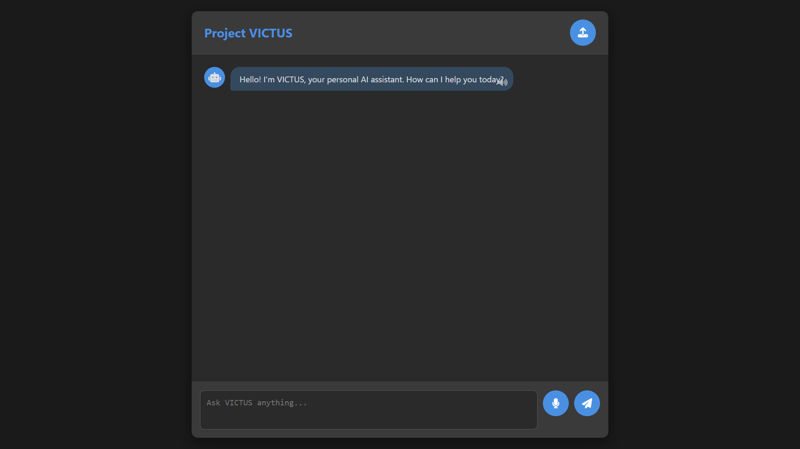
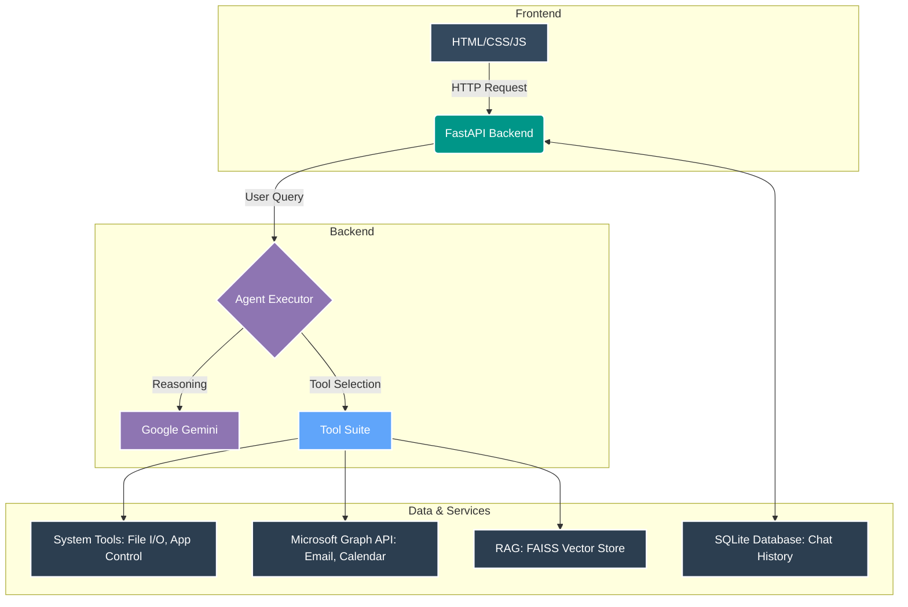

# Project VICTUS: The AI Personal Assistant

<p align="center">
  <strong>An advanced, voice-enabled, conversational AI personal assistant built for seamless productivity and system control.</strong>
</p>

<p align="center">
  
</p>

---

## ✨ Core Features

Project VICTUS is engineered to be a central hub for your digital life, capable of understanding context, performing complex actions, and integrating deeply with your most-used services.

| Feature                      | Description                                                                                                                              |
| ---------------------------- | ---------------------------------------------------------------------------------------------------------------------------------------- |
| 🗣️ **Voice Interface** | Real-time, low-latency Speech-to-Text and Text-to-Speech for a natural, hands-free conversational experience.                            |
| 🧠 **Advanced Agentic Brain** | Powered by Google's Gemini model and orchestrated with LangChain's AgentExecutor for superior reasoning and dynamic tool selection.      |
| 📄 **Persistent Document Q&A** | Upload PDF and DOCX files to a persistent FAISS vector store, enabling the agent to answer questions based on your documents.             |
| 💻 **Intelligent System Tools**| Go beyond basic commands. VICTUS can dynamically find and open any installed application (including Store apps), manage files, and access your clipboard. |
| 📧 **Full Microsoft 365 Suite**| Securely authenticate to read/send Outlook emails and create/read Outlook calendar events using the Microsoft Graph API.                 |
| 💾 **Persistent Memory** | A complete chat history is stored in a local SQLite database, ensuring the agent remembers your conversations across sessions.          |

---

## 🏛️ System Architecture

The project follows a modular, decoupled architecture to ensure maintainability and scalability. The core components interact as follows:



---

## 🛠️ Tech Stack

This project is built on a modern, high-performance, and scalable technology stack, chosen for its reliability and developer experience.

| Component         | Technology                                                                                                  |
| ----------------- | ----------------------------------------------------------------------------------------------------------- |
| **Backend** |        |
| **AI Agent** |   |
| **Voice I/O** |  |
| **Vector Store** |               |
| **Dependencies** |                                      |
| **Deployment** |   |

---

## 🚀 Getting Started

Follow these steps to set up and run Project VICTUS on your local machine.

### **1. Prerequisites**

Make sure you have the following installed:
* [Python 3.11+](https://www.python.org/)
* [Poetry](https://python-poetry.org/docs/#installation) (for dependency management)
* [Docker](https://www.docker.com/products/docker-desktop/) (for containerized deployment)
* **Note**: The advanced system tools (`open_app`, `list_files`) are currently configured and optimized for the **Windows** operating system.

### **2. API Keys & Configuration**

You will need to acquire API keys from the following services:

* **Google AI Studio**: For the `GOOGLE_API_KEY`.
* **Tavily AI**: For the `TAVILY_API_KEY`.
* **Microsoft Azure**: This is required for the M365 tools.
    1.  Navigate to **Azure Active Directory** > **App registrations** > **New registration**.
    2.  Name it `ProjectVictus`. Select the "multitenant and personal Microsoft accounts" option.
    3.  Once created, copy the **Application (client) ID** and **Directory (tenant) ID**.
    4.  Go to **API permissions** > **Add a permission** > **Microsoft Graph** > **Delegated permissions**. Add `User.Read`, `Mail.ReadWrite`, `Mail.Send`, and `Calendars.ReadWrite`.
    5.  Go to **Authentication** and enable **Allow public client flows**.

### **3. Environment Setup**

1.  Clone this repository or create the project files as provided.
2.  Create a file named `.env` in the project root and populate it with your keys:
    ```env
    # .env
    GOOGLE_API_KEY="YOUR_GOOGLE_API_KEY"
    TAVILY_API_KEY="YOUR_TAVILY_API_KEY"
    MS_CLIENT_ID="YOUR_AZURE_APP_CLIENT_ID"
    MS_TENANT_ID="YOUR_AZURE_APP_TENANT_ID"
    ```

### **4. Voice Model**

1.  Create a `models` directory in the project root.
2.  Download a voice model from [Piper Voices](https://huggingface.co/rhasspy/piper-voices/tree/main). We recommend `en_US-lessac-medium`.
3.  Place both the `.onnx` and `.onnx.json` files inside the `models` directory.

---

## ▶️ Installation & Running

### **1. Install Dependencies**

Open your terminal in the project root and run:
```bash
poetry install
```

### **2. Run the Application**

#### **Local Development**
For testing and development, use the Uvicorn server with hot-reloading:
```bash
poetry run uvicorn main:app --reload
```

#### **Production (Docker)**
For a stable, containerized instance:
1.  **Build the image:**
    ```bash
    docker build -t project-victus .
    ```
2.  **Run the container:**
    ```bash
    docker run -d -p 8000:8000 --name victus-container --env-file .env -v $(pwd)/faiss_index:/app/faiss_index -v $(pwd)/uploads:/app/uploads -v $(pwd)/chat_history.db:/app/chat_history.db -v $(pwd)/.msal_token_cache.json:/app/.msal_token_cache.json project-victus
    ```

Once the server is running, navigate to `http://localhost:8000` in your browser.

---

## 📝 Usage Guide

* **Text Input**: Type your message and press `Enter` to send.
* **Voice Input**: Click the microphone icon to start recording; click it again to stop and send.
* **Voice Output**: Click the speaker icon next to any of VICTUS's messages to hear it read aloud.
* **Document Upload**: Use the upload button to add a PDF or DOCX file to the agent's knowledge base.
* **Microsoft 365 Login**: The first time you request an M365 action (e.g., "read my email"), check the **terminal** where the server is running. It will provide a code and a URL (`https://microsoft.com/devicelogin`) to complete the secure, one-time authentication.

---

## ☁️ Deployment

This application is designed for easy deployment to the cloud.

* **Live Application**: `[Link to your deployed AWS App Runner URL]`
* **Docker Image**: `[https://hub.docker.com/r/jadhavgaurav007/project-victus]`

The recommended target is **AWS App Runner**:
1.  **Push the Docker Image**: Build the image and push it to a private Amazon ECR repository or a public Docker Hub repository.
2.  **Create App Runner Service**: Create a new service in AWS App Runner, pointing to your image.
3.  **Configure**: Set the port to `8000` and add your API keys as environment variables in the App Runner configuration.

App Runner will handle the rest, providing you with a secure, public HTTPS URL for your application.

---

## 📁 Project Structure

<details>
<summary>Click to view the project file structure</summary>

```
project_victus/
├── .env
├── .gitignore
├── Dockerfile
├── README.md
├── agent.py
├── auth.py
├── database.py
├── main.py
├── models/
│   └── en_US-lessac-medium.onnx
│   └── en_US-lessac-medium.onnx.json
├── models.py
├── poetry.lock
├── pyproject.toml
├── static/
│   ├── index.html
│   ├── script.js
│   └── style.css
└── tools.py
```
</details>

---

## 👨‍💻 Author

This project was architected and developed by **Gaurav Vijay Jadhav**, an AI Engineer specializing in computer vision, NLP, and the end-to-end deployment of production-ready AI systems.
